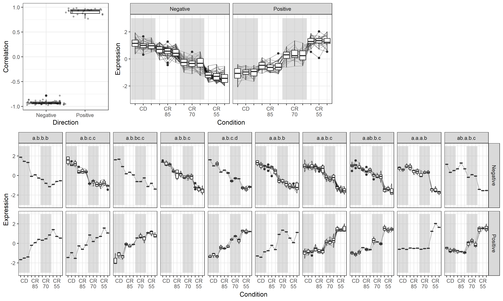

# ss.boxplot

This codes were written for `Mouse CR Liver project` at `2018-08-18`.

To draw this figure, I used packages, including `ggplot2`, `reshape`, and `gridExtra`.

First, data input and reshape for ggplot favorite form.

```R
date = "180817" #<- for file name prefix
probe = read.csv("R_input/170407_Mouse Liver CR DEGs.csv")
print(dim(probe)); print(colnames(probe))

# calculate correlation values
cr_str = c(0,0,0,15,15,15,30,30,30,45,45,45)
cor_r = apply(probe[,2:13],1,function(x) {
    cor(x,cr_str,method="pearson")
})
cor_r = data.frame(Correlation=cor_r)
print(dim(cor_r)); summary(cor_r)
```


## 1. Correlation boxplot

```R
cor_df = cor_r
cor_df$Direction = "Positive"
cor_df[cor_df$Corr<0,"Direction"] = "Negative" # Good!
cor_df[sample(nrow(cor_df),5),]
```

```R
library(ggplot2)
g1 = ggplot(cor_df,aes(x=Direction,y=Correlation))+theme_bw()+
    geom_boxplot()+
    geom_jitter(position=position_jitter(width=.5,height=0),
                color="black",alpha=.3,size=1)
#ggsave(paste(date,"corr_box.png"),g1,width=5,height=7,units="cm")
```


## 2. Calculate Tukey

I used for this step, `160504` version in `ss.tukey.md` file.

```R
groups = c("CD","CD","CD","CR85","CR85","CR85","CR70","CR70","CR70","CR55","CR55","CR55")
groups = factor(groups,levels=c("CD","CR85","CR70","CR55"))

tukey = ss.tukey2(probe[,2:13],groups)
head(tukey,5)
```

```R
tukey_ = cbind(AffyID=probe[,1],tukey[,c(4,1:3)])
tukey_$Tukey = apply(tukey[,c(4,1:3)],1,function(x)paste(x,collapse="."))

tuk = tukey_$Tukey
key = c(d.a.b.c="a.b.c.d", b.ab.a.c="a.ab.b.c", c.a.a.b="a.b.b.c",
        c.a.ab.b="a.b.bc.c", c.a.b.b="a.b.c.c",b.a.a.a="a.b.b.b")
for(i in 1:length(key)){ tuk = replace(tuk,tuk==names(key[i]),key[i]) }
tukey_$Tukey2 = unlist(tuk)
head(tukey_)
```

Save result as csv file.

```R
tukey_cor = cbind(tukey_,cor_r)
write.csv(tukey_cor,paste(date,"tukey_cor.csv"),row.names=F)
```


## 3. Gene Expression Boxplot

Converting array signal intensity to z-score

```R
mat = t(scale(t(probe[,2:13])))
mat_df = as.data.frame(mat)
mat_df = cbind(AffyID=probe[,1],mat_df,cor_df,Tukey=tukey_[,7])
mat_df[sample(nrow(mat_df),5),]
```

Transforming 2-d table into ggplot-favorite form using `reshape` package

```R
library(reshape)
mat_df_=mat_df[,c(1:4, 7,6,5, 8,9,10, 13,11,12, 14:ncol(mat_df))] # reorder for x-axis
melt_df = melt(mat_df_,id=c("AffyID","Correlation","Direction","Tukey"))
colnames(melt_df)[5:6] = c("Condition","Expression")
melt_df[sample(nrow(melt_df),5),]
```

Setting background gray box to isolate CR conditions

```R
print(paste0("ymin= ",min(melt_df$Expression),", ymax= ",max(melt_df$Expression)))
box = data.frame(xmin=c(0.5,6.5),xmax=c(3.5,9.5),ymin=c(-3,-3),ymax=c(3,3))
box
```

ggplot - `farcet_grid` order decision

```R
# facet_wrap 순서 정하기
print(dim(melt_df))
tukey_order = c("a.b.b.b","a.b.c.c","a.b.bc.c","a.b.b.c","a.b.c.d",
                "a.a.b.b","a.a.b.c","a.ab.b.c","a.a.a.b","ab.a.b.c")
melt_df$Tukey_f = factor(melt_df$Tukey,levels=tukey_order)
print(length(Tukey_f)); print(head(Tukey_f))
```

Draw total gene expression dividing positive/negative correlation directions.

```R
library(ggplot2)
g2_a=ggplot(melt_df,aes(x=Condition,y=Expression))+theme_bw()+
    geom_line(aes(group=AffyID),colour="black",alpha=.3)+
    geom_rect(data=box, inherit.aes=F,fill="gray",alpha=.5,
              aes(xmin=xmin,xmax=xmax,ymin=ymin,ymax=ymax))+
    geom_boxplot()+
    scale_x_discrete(labels=c("","CD","","","CR\n85","","","CR\n70","","","CR\n55",""))+
    facet_grid(~Direction)+guides(fill="none")
```

Second gene expression boxplot dividing by Tukey patterns and correlation directions

```R
g2_b=ggplot(melt_df,aes(x=Condition,y=Expression))+theme_bw()+
    geom_line(aes(group=AffyID),colour="black",alpha=.3)+
    geom_rect(data=box,inherit.aes=F,fill="gray",alpha=.5,
              aes(xmin=xmin,xmax=xmax,ymin=ymin,ymax=ymax))+
    geom_boxplot()+
    scale_x_discrete(labels=c("","CD","","","CR\n85","","","CR\n70","","","CR\n55",""))+
    facet_grid(vars(Direction),vars(Tukey_f))+guides(fill="none")
```


## 4. Laying out multiple plots

To lay out multiple ggplot graphs, I used `gridExtra` packages.

```R
# Laying out multiple plots
## https://cran.r-project.org/web/packages/egg/vignettes/Ecosystem.html
library(gridExtra)
g=grid.arrange(g1,g2_a,g2_b, layout_matrix=rbind(c(1,2,4),c(3,3,3)),
               widths=c(1,2,2), heights=c(1.5,2)); print(g)
ggsave(paste(date,"corr_expression.png"),g,width=30,height=18,units="cm")
```

